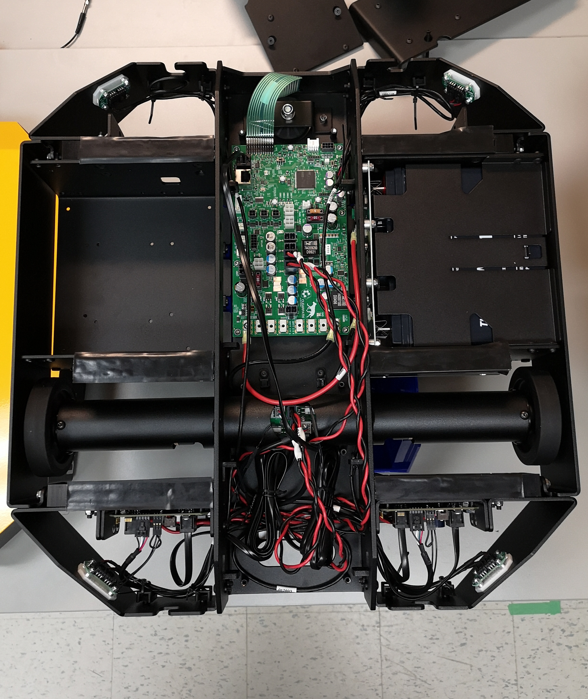
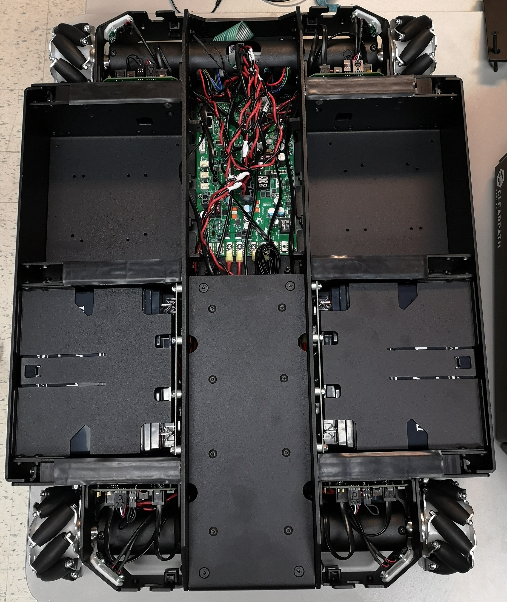

Custom Computer Installation
==================================

Some Dingo-O and Dingo-D robots may be sold without a main PC installed.  If you have such a robot, you must provide
your own PC for the robot.

This section explains the process of physically connecting your computer to Dingo.  For OS and software installation,
see :doc:`Software Setup <software_setup>`.

.. note::

  For installing the OS on an Nvidia Jetson device, see :doc:`Jetson Xavier AGX <jetson_xavier>` or
  :doc:`Jetson Nano <jetson_nano>`.

Supported PCs
--------------

Dingo has mounting hole patterns for standard mini-ITX motherboards and Nvidia Jetson Nano, NX, & Xavier AGX computers.

.. note::

  Support for the Raspberry Pi 4 is coming at a future date.  For now there are no official mounting solutions, but
  you may be able to create your own bracket for connecting the Rasperry Pi family of computers to Dingo.

We recommend the following minimum requirements for any custom PC installed in Dingo:

.. note::

  Note that some accessories, such as 3d lidar, depth-sensing cameras, high-res cameras, and arms may have their
  own additional requirements that exceed these minimums.

* CPU: Quad-core amd64 or arm64 at 1.4GHz or faster
* RAM: 4GB
* Storage: 64GB
* At least 1 physical ethernet port

Mounting the PC
----------------

Mini-ITX format PCs, as well as the Nvidia Jetson family can be mounted directly to Dingo's chassis using the provided
mounting holes.  We recommend using 20-30mm standoffs to ensure adequate clearance between the chassis and any ports
on the board.

Dingo-D has a single payload bay for the computer, opposite the battery bay.  Dingo-O has two computer bays, located in
front of the two battery bays.

|DIFF_PAYLOAD| |OMNI_PAYLOAD|

Small single-board PCs, such as the Raspberry Pi can be installed by either creating a custom 3d-printed bracket to make
use of the existing mounting holes, or be affixed to the computer bay using adhesive on a third-party enclosure.

During OS installation you will need access to the USB, ethernet, and video ports of the PC.  After installation
the PC will need to be connected to the MCU via an ethernet cable.

Powering the PC
----------------

Dingo's PC should be powered by connecting it directly to ``VBATT`` if it is tolerant to varying voltage (e.g.
a mini-ITX format PC with a pico-PSU), or to one of ``PWR1`` or ``PWR1``.

``VBATT`` provides unregulated power drawn directly from Dingo's batteries.  At full charge this will be 12-14V, and
can be expected to decline steadily as the robot is used.

``PWR1`` and ``PWR2`` can provide regulated 12V or 5V output by using the following pin mappings:

======  ======== ======================
Pin #   Pinout   Current Limit
======  ======== ======================
1       12V      10A total, 8A per pin
2       5V       5A
3       gnd
4       gnd
======  ======== ======================

Check your computer's power requirements and connect its power to the appropriate power supply.

Note that the computer should not be connected to any of the ``AUX`` power supplies.  These are intended to supply
power to accessories such as sensors and lightweight arms that require external power.

.. image:: images/mcu.jpg
  :alt: Dingo's MCU

The image above shows Dingo's MCU. ``PWR1`` and ``PWR2`` are the large white connectors in the middle.  The 3 black
connectors below them are ``AUX1-3``.  ``VBATT`` is the large, black, 2-pin connector located near at the bottom, near
the 10A and 20A fuses.

Installing a network switch
----------------------------

Because many sensors use ethernet connectivity you may find it useful to install a small ethernet switch inside Dingo's
main center bay.

Power for the switch should be drawn from AUX2 or AUX3, as dictated by the switch's input voltage (see above).
