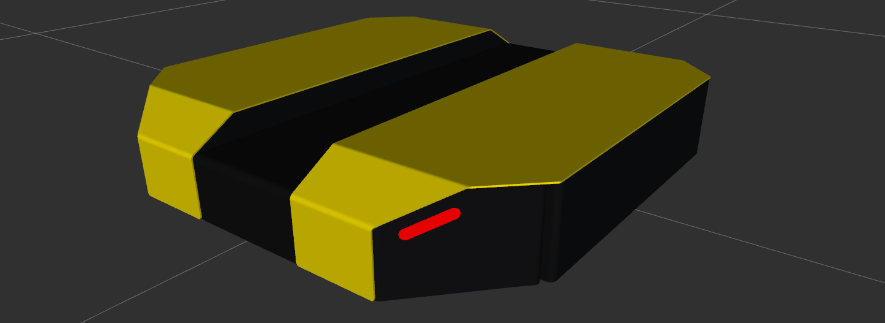

dingo_description Package
===========================

The jackal_description package is the URDF robot description for Dingo

.. _Source: https://github.com/dingo-cpr/dingo

Overview
---------

This package provides a `URDF <http://wiki.ros.org/urdf>`_ model of Dingo.  For an example launchfile to use in visualizing this model, see `dingo_viz <http://wiki.ros.org/dingo_viz>`_.

Mounting Points
-----------------

Dingo-D has 6 evenly-spaced mounting points along its center channel for mounting sensors and other accessories.  Dingo-O
has 7 similar mounting points.  The centers of these mounting points are represented as links in the URDF to facilitate
adding sensors to simulated robots & modelling collisions when planning arm motions for mobile manipulation.

====================== ========== ==========
Link (front to back)   Dingo-D    Dingo-O
====================== ========== ==========
``front_mount``        Yes        Yes
``front_b_mount``      Yes        Yes
``front_c_mount``      Yes        Yes
``mid_mount``          No         Yes
``rear_c_mount``       Yes        Yes
``rear_b_mount``       Yes        Yes
``rear_mount``         Yes        Yes
====================== ========== ==========

Dingo-D mount points:

.. image:: images/dingo-d-mounts.png
  :alt: Dingo-D mount points

Dingo-O mount points:

.. image:: images/dingo-o-mounts.png
  :alt: Dingo-O mount points

Both versions of Dingo also provide a ``front_bumper_mount``, located directly on the front of the robot.  While the physical
robot does not have any mounting holes here, lightweight sensors (e.g. small cameras) can be placed here using double-sided
adhesive if required.

.. image:: images/dingo-d-front_bumper_mount.png
  :alt: front_bumper_mount

Environment Variables
-----------------------

Dingo can be customized & extended through the use of several enviroment variables. These variables are listed below, along with a
summary of their effects and default values

.. raw:: html

    <table><tbody><tr><td>
<strong>Variable</strong> 
</td>
      <td>
<strong>Default</strong> 
</td>
      <td>
<strong>Description</strong> 
</td>
    </tr>
    <tr><td>
<tt>DINGO_OMNI</tt> 
</td>
      <td>
<tt>0</tt> 
</td>
      <td>
Set to 1 to switch from Dingo-D to Dingo-O (with omni-directional mecanum wheels)
</td>
    </tr>
    <tr><td>
<tt>DINGO_URDF_EXTRAS</tt> 
</td>
      <td>
<tt>emptyu.urdf</tt> 
</td>
      <td>
Specifies the path to a URDF file with which to extend the robot's physical configuraiton
</td>
    </tr>
    <tr><td>
<tt>DINGO_CONTROL_EXTRAS</tt> 
</td>
      <td>
<tt>0</tt> 
</td>
      <td>
Set to 1 to enable loading <tt>DINGO_CONTROL_EXTRAS_PATH</tt>
</td>
    </tr>
    <tr><td>
<tt>DINGO_CONTROL_EXTRAS_PATH</tt> 
</td>
      <td>
<i>undefined</i> 
</td>
      <td>
Path to a YAML file on-disk that can be used to override or extend Dingo's default controls
</td>
    </tr>
    <tr><td>
<tt>DINGO_CONFIG</tt> 
</td>
      <td>
<tt>base</tt> 
</td>
      <td>
Specifies what pre-made sensor/mission configuration to load (see below)
</td>
    </tr>
    <!--
      Primary LIDAR Sensors
    -->
    <tr><td>
<tt>DINGO_LASER</tt> 
</td>
      <td>
<tt>0</tt> 
</td>
      <td>
Set to 1 to equip Dingo with a primary lidar unit, normally front-facing
</td>
    </tr>
    <tr><td>
<tt>DINGO_LASER_MODEL</tt> 
</td>
      <td>
<tt>lms1xx</tt> 
</td>
      <td>
        
Sets the model of lidar sensor on the robot. Ignored if <tt>DINGO_LASER</tt> is <tt>0</tt>.  Allowed values are:

        <ul>
          <li><tt>lms1xx</tt> - Sick LMS-1xx (default)</li>
          <li><tt>ust10</tt> - Hokuyo UST-10</li>
        </ul>
      </td>
    </tr>
    <tr><td>
<tt>DINGO_LASER_MOUNT</tt> 
</td>
      <td>
<tt>front</tt> 
</td>
      <td>
        
Defines the mount point the Dingo's laser is connected to.  Allowed values are:

        <ul>
          <li><tt>front[_b|_c]</tt></li>
          <li><tt>mid</tt> (Dingo-O only)</li>
          <li><tt>rear[_b|_c]</tt></li>
        </ul>
      </td>
    </tr>
    <tr><td>
<tt>DINGO_LASER_TOPIC</tt> 
</td>
      <td>
<tt>front/scan</tt> 
</td>
      <td>
The ROS topic that Dingo's lidar publishes on
</td>
    </tr>
    <tr><td>
<tt>DINGO_LASER_OFFSET</tt> 
</td>
      <td>
<tt>0.11 0 0</tt> 
</td>
      <td>
XYZ offset for Dingo's lidar
</td>
    </tr
    <tr><td>
<tt>DINGO_LASER_RPY</tt> 
</td>
      <td>
<tt>0 0 0</tt> 
</td>
      <td>
RPY offset for Dingo's lidar
</td>
    </tr>
    <!--
      Secondary LIDAR (ARK)
    -->
    <tr><td>
<tt>DINGO_LASER_SECONDARY</tt> 
</td>
      <td>
<tt>0</tt> 
</td>
      <td>
Set to 1 to equip Dingo with a secondary lidar unit, normally rear-facing
</td>
    </tr>
    <tr><td>
<tt>DINGO_LASER_SECONDARY_MODEL</tt> 
</td>
      <td>
<tt>lms1xx</tt> 
</td>
      <td>
        
Sets the model of secondary lidar sensor on the robot. Ignored if <tt>DINGO_LASER_SECONDARY</tt> is <tt>0</tt>.  Allowed values are:

        <ul>
          <li><tt>lms1xx</tt> - Sick LMS-1xx (default)</li>
          <li><tt>ust10</tt> - Hokuyo UST-10</li>
        </ul>
      </td>
    </tr>
    <tr><td>
<tt>DINGO_LASER_SECONDARY_MOUNT</tt> 
</td>
      <td>
<tt>rear</tt> 
</td>
      <td>
        
Defines the mount point the Dingo's secondary laser is connected to.  Allowed values are:

        <ul>
          <li><tt>front[_b|_c]</tt></li>
          <li><tt>mid</tt> (Dingo-O only)</li>
          <li><tt>rear[_b|_c]</tt></li>
        </ul>
      </td>
    </tr>
    <tr><td>
<tt>DINGO_LASER_SECONDARY_TOPIC</tt> 
</td>
      <td>
<tt>rear/scan</tt> 
</td>
      <td>
The ROS topic that Dingo's secondary lidar publishes on
</td>
    </tr>
    <tr><td>
<tt>DINGO_LASER_SECONDARY_OFFSET</tt> 
</td>
      <td>
<tt>-0.11 0 0</tt> 
</td>
      <td>
XYZ offset for Dingo's secondary lidar
</td>
    </tr
    <tr><td>
<tt>DINGO_LASER_SECONDARY_RPY</tt> 
</td>
      <td>
<tt>0 0 3.14159</tt> 
</td>
      <td>
RPY offset for Dingo's secondary lidar
</td>
    </tr>
    <!--
      3D LIDAR
    -->
    <tr><td>
<tt>DINGO_LASER_3D</tt> 
</td>
      <td>
<tt>0</tt> 
</td>
      <td>
Set to 1 to equip Dingo with a primary 3D lidar unit, normally front-facing
</td>
    </tr>
    <tr><td>
<tt>DINGO_LASER_3D_MODEL</tt> 
</td>
      <td>
<tt>vlp16</tt> 
</td>
      <td>
        
Sets the model of lidar sensor on the robot. Ignored if <tt>DINGO_LASER_3D</tt> is <tt>0</tt>.  Allowed values are:

        <ul>
          <li><tt>vlp16</tt> - Velodyne VLP-16 (default)</li>
          <li>No other models supported yet, but may be expanded in future</li>
        </ul>
      </td>
    </tr>
    <tr><td>
<tt>DINGO_LASER_3D_MOUNT</tt> 
</td>
      <td>
<tt>front</tt> 
</td>
      <td>
        
Defines the mount point the Dingo's 3D laser is connected to.  Allowed values are:

        <ul>
          <li><tt>front[_b|_c]</tt></li>
          <li><tt>mid</tt> (Dingo-O only)</li>
          <li><tt>rear[_b|_c]</tt></li>
        </ul>
      </td>
    </tr>
    <tr><td>
<tt>DINGO_LASER_3D_TOPIC</tt> 
</td>
      <td>
<tt>front/points</tt> 
</td>
      <td>
The ROS topic that Dingo's 3D lidar publishes on
</td>
    </tr>
    <tr><td>
<tt>DINGO_LASER_3D_OFFSET</tt> 
</td>
      <td>
<tt>0 0 0</tt> 
</td>
      <td>
XYZ offset for Dingo's 3D lidar
</td>
    </tr
    <tr><td>
<tt>DINGO_LASER_3D_RPY</tt> 
</td>
      <td>
<tt>0 0 0</tt> 
</td>
      <td>
RPY offset for Dingo's 3D lidar
</td>
    </tr>
    <!--
      RealSense Sensors
    -->
    <tr><td>
<tt>DINGO_REALSENSE</tt> 
</td>
      <td>
<tt>0</tt> 
</td>
      <td>
Set to 1 to equip Dingo with a RealSense depth camera
</td>
    </tr>
    <tr><td>
<tt>DINGO_REALSENSE_MODEL</tt> 
</td>
      <td>
<tt>d435</tt> 
</td>
      <td>
        
Sets the model of RealSense camera on the robot. Ignored if <tt>DINGO_REALSENSE</tt> is <tt>0</tt>.  Allowed values are:

        <ul>
          <li><tt>d435</tt> (default)</li>
          <li><tt>d435i</tt></li>
          <li><tt>d415</tt></li>
          <li><tt>d455</tt> <i>Note: this camera is not supported by the <tt>realsense2_camera</tt> package yet; it is included or future compatibility</i></li>
          <li><tt>l515</tt></li>
        </ul>
      </td>
    </tr>
    <tr><td>
<tt>DINGO_REALSENSE_MOUNT</tt> 
</td>
      <td>
<tt>front</tt> 
</td>
      <td>
        
Defines the mount point the Dingo's RealSense is connected to

        <ul>
          <li><tt>front</tt></li>
          <li><tt>mid</tt></li>
          <li><tt>rear</tt></li>
          <li><tt>front_bumper</tt></li>
        </ul>
      </td>
    </tr>
    <tr><td>
<tt>DINGO_REALSENSE_TOPIC</tt> 
</td>
      <td>
<tt>realsense</tt> 
</td>
      <td>
The ROS namespace that Dingo's Realsense topics publish in.  e.g. pointcloud data will be in <tt>$(DINGO_REALSENSE_TOPIC)/depth/color/points</tt>
</td>
    </tr>
    <tr><td>
<tt>DINGO_REALSENSE_OFFSET</tt> 
</td>
      <td>
<tt>0 0 0</tt> 
</td>
      <td>
XYZ offset for Dingo's RealSense
</td>
    </tr
    <tr><td>
<tt>DINGO_REALSENSE_RPY</tt> 
</td>
      <td>
<tt>0 0 0</tt> 
</td>
      <td>
RPY offset for Dingo's RealSense
</td>
    </tr>
    </tbody></table>

Mobile Manipulaton Environment Variables
-------------------------------------------

The following variables are only supported when the :doc:`mobile manipulation <manipulation>` package is in-use.

.. raw:: html

    <table><tbody><tr><td>
<strong>Variable</strong> 
</td>
      <td>
<strong>Default</strong> 
</td>
      <td>
<strong>Description</strong> 
</td>
    </tr>
    <!--
      Arm Configuration
    -->
    <tr><td>
<tt>DINGO_ARM_MODEL</tt> 
</td>
      <td>
<tt>gen3_lite</tt> 
</td>
      <td>
The model of arm mounted to the Dingo
</td>
    </tr>
    <tr><td>
<tt>DINGO_ARM_GRIPPER</tt> 
</td>
      <td>
<tt>gen3_lite_2f</tt> 
</td>
      <td>
The type of gripper mounted to the end of the arm
</td>
    </tr>
    <tr><td>
<tt>DINGO_ARM_DOF</tt> 
</td>
      <td>
<tt>6</tt> 
</td>
      <td>
The number of degrees of freedom in the arm
</td>
    </tr>
    <tr><td>
<tt>DINGO_ARM_MOUNT</tt> 
</td>
      <td>
<tt>front_b_mount</tt> 
</td>
      <td>
Specifies the link that the arm is attached to in the URDF
</td>
    </tr>
    <tr><td>
<tt>DINGO_ARM_XYZ</tt> 
</td>
      <td>
<tt>0 0 0</tt> 
</td>
      <td>
XYZ offset for Dingo's arm relative to its mounting point
</td>
    </tr>
    <tr><td>
<tt>DINGO_ARM_RPY</tt> 
</td>
      <td>
<tt>0 0 0</tt> 
</td>
      <td>
RPY offset for Dingo's arm relative to its mounting point
</td>
    </tr>
    <tr><td>
<tt>DINGO_ARM_HOST</tt> 
</td>
      <td>
<tt>192.168.131.40</tt> 
</td>
      <td>
IP address of the Dingo's arm
</td>
    </tr>
    <tr><td>
<tt>DINGO_ARM_EXTERNAL_POWER</tt> 
</td>
      <td>
<tt>0</tt> 
</td>
      <td>
Set to 1 to add the arm's power regulator to the robot's URDF
</td>
    </tr>
    <tr><td>
<tt>DINGO_ARM_EXTERNAL_POWER_MOUNT</tt> 
</td>
      <td>
<tt>rear_b_mount</tt> 
</td>
      <td>
Specifies the link the external power regulator is attached to
</td>
    </tr>
    <tr><td>
<tt>DINGO_ARM_EXTERNAL_POWER_XYZ</tt> 
</td>
      <td>
<tt>0 0 0</tt> 
</td>
      <td>
The XYZ offset for the external power regulator relative to its mount point
</td>
    </tr>
    <tr><td>
<tt>DINGO_ARM_EXTERNAL_POWER_RPY</tt> 
</td>
      <td>
<tt>0 0 0</tt> 
</td>
      <td>
The RPY offset for the external power regulator relative to its mount point
</td>
    </tr>
    </tbody></table>

Configurations
-----------------

As an alternative to individually specifying each accessory, some fixed configurations are provided in the package. These can be specified using the ``config arg to description.launch``, and are intended especially as a convenience for simulation launch.

====================================  ====================================================
Config:                               Description:
====================================  ====================================================
base                                  Base Dingo
front_laser                           Adds a SICK LMS1xx lidar to the Dingo's front mount
====================================  ====================================================

.. Note::

  Additional configurations coming soon
