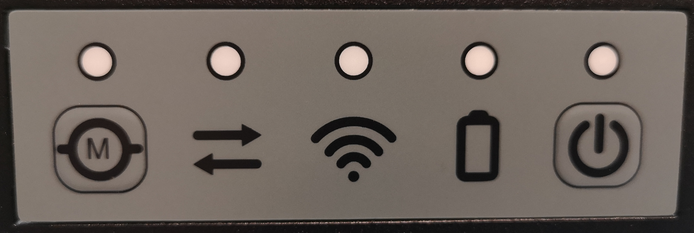
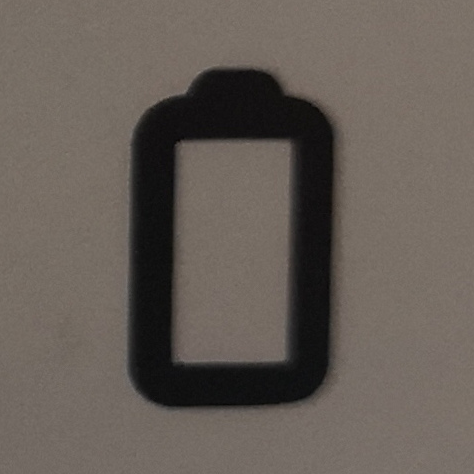
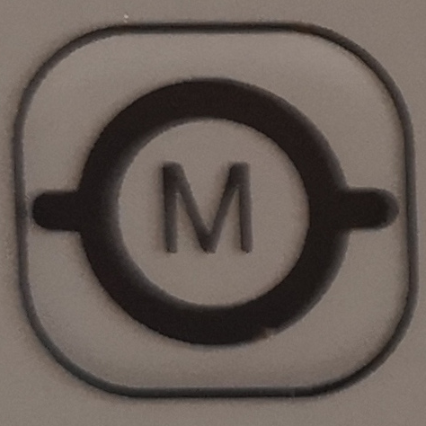
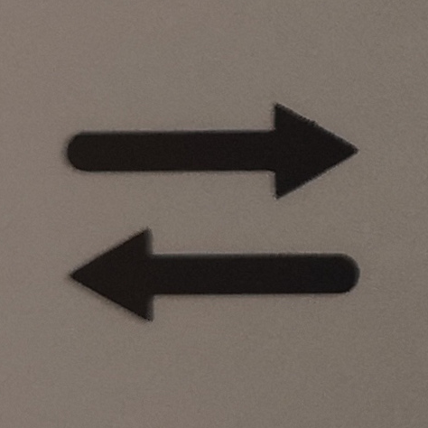
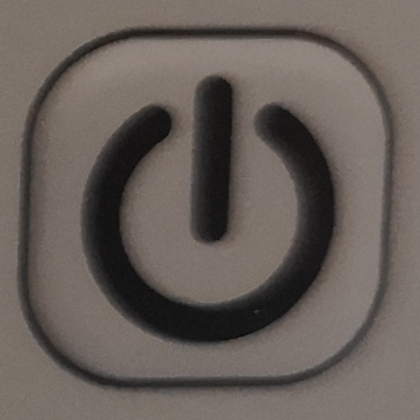
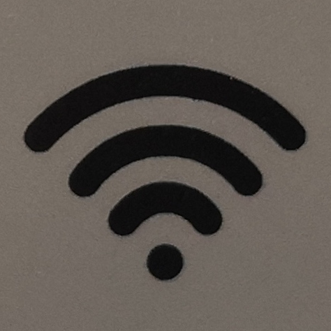

Status Indicators
==========================

Dingo has four configurable LEDs on the corners of the chassis, as well as a Human-Machine Interface (HMI) panel on the
rear of the robot.  These lights are used to indicate the robot's status.

HMI Panel
-----------

From left-to right the HMI panel controls are:

================  ========================= ============================================================
Icon              Description               LED Colors
================  ========================= ============================================================
|hmi_estop|       Emergency-stop            Green: motors are powered.  Red: e-stop is engaged.
|hmi_mcu|         MCU connection status     Green: MCU working. Red/off: error communicating with MCU
|hmi_wifi|        Wi-Fi connection status   Green: Wi-fi connected.  Off: Wi-fi offline
|hmi_battery|     Battery status            Green: Battery OK.  Red: Battery low
|hmi_power|       Power button              Green: robot is on.  Off: robot is off
================  ========================= ============================================================

Corner LEDs
-------------

The corner LEDs use the following patterns to indicate the robot's status:

===============  ===============  ====================
Front LEDs       Rear LEDs        Description
===============  ===============  ====================
Solid white      Solid red        Normal operation
Pulsing orange   Pulsing orange   Battery is low
Flashing orange  Flashing orange  Fault
Flashing red     Flashing red     E-stop is engaged
Solid red        Solid red        ROS is not running
===============  ===============  ====================

While the robot is in the normal operation state the LED colors can be customized by publishing to the ``/cmd_lights``
topic.  In any other state LED customization is disabled.
