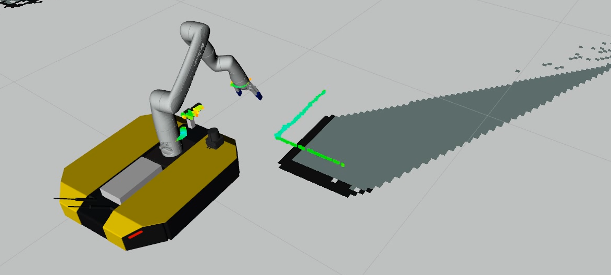
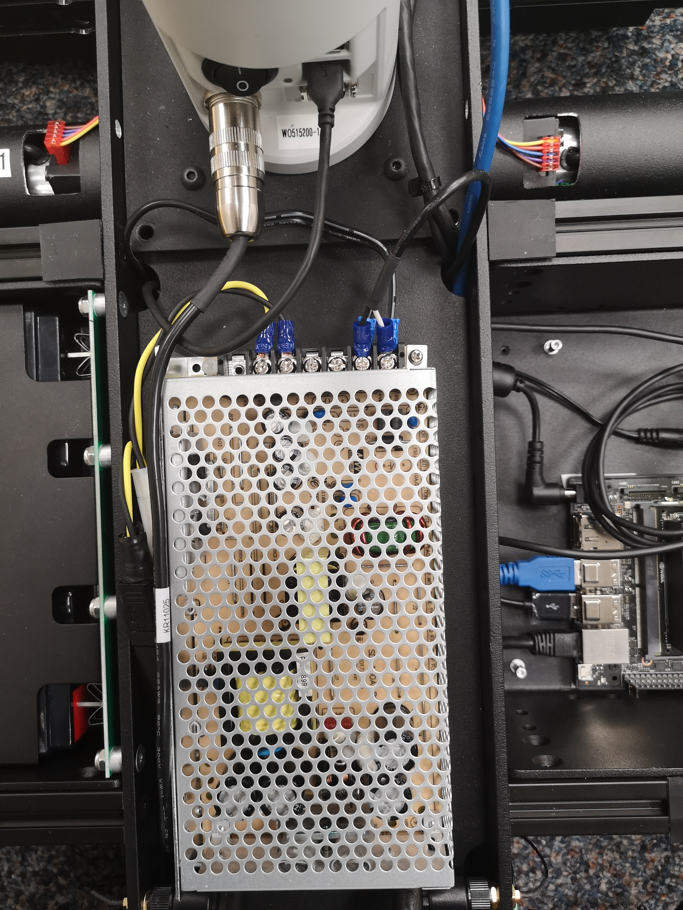
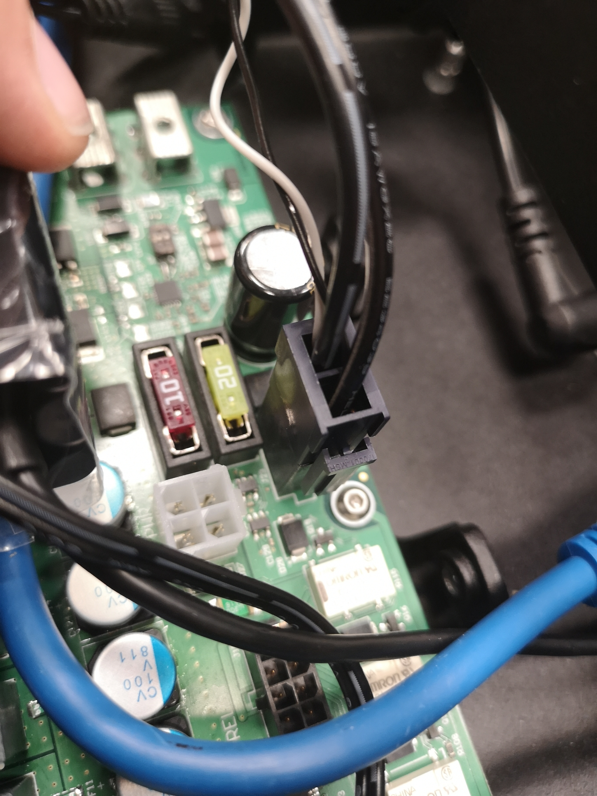
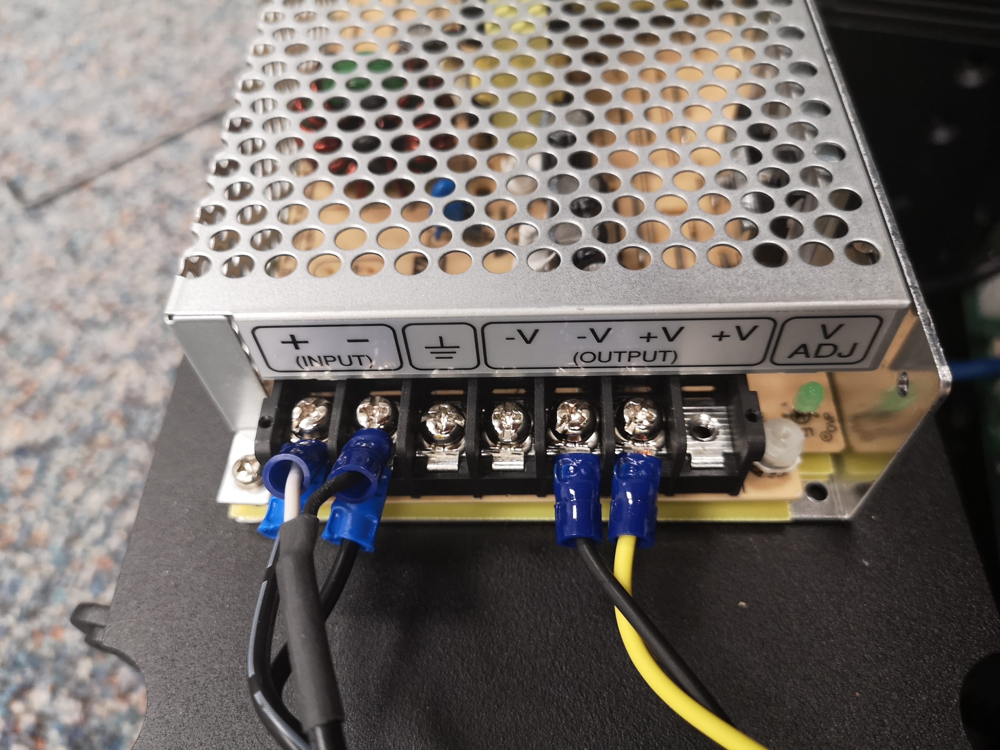
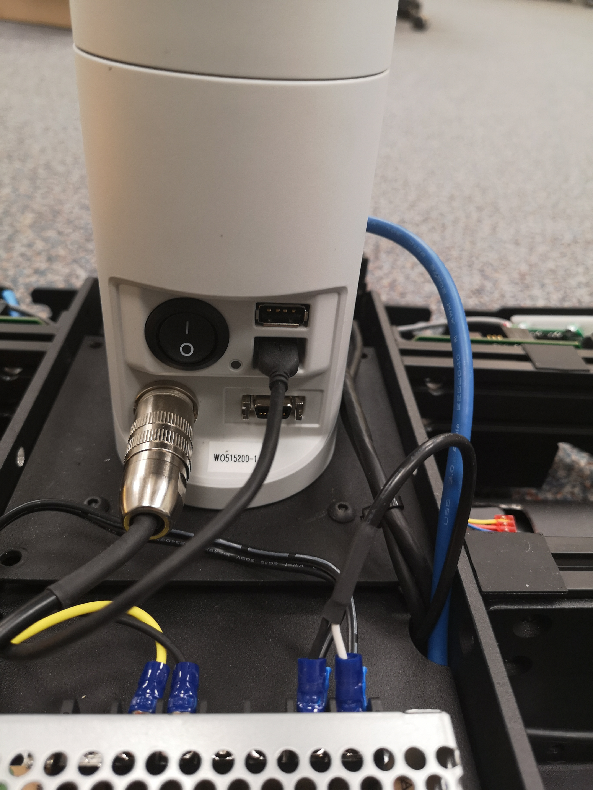
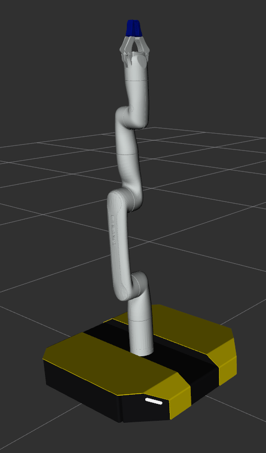
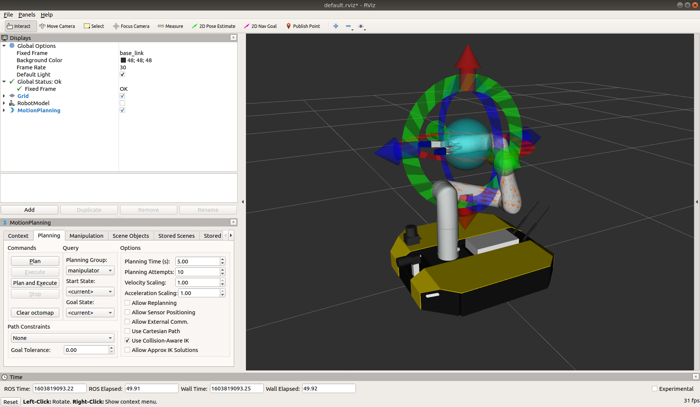

Mobile Manipulation
======================

.. warning::

  To-date the Gen3 Lite arm has only been tested on Dingo-D; while the Dingo-O is technically capable of supporting it,
  there may be additional configuration steps & debugging needed.

The Dingo-O and Dingo-D can support a Kinova Gen3 Lite 6-DOF arm.  This section explains how to add the arm to
your robot and install the appropriate drivers.

Physical Installation
------------------------

First, power off the robot and install the arm.  The arm's power regulator can be placed inside one of the
extra payload bays on the Dingo-O.  On Dingo-D the power regulator must be mounted to the outside of the robot.

Connect the input power to the Gen3 Lite's power regulator to the VBAT connector on Dingo's MCU:

Connect the output power from the Gen3 Lite's power cable.

Connect the MicroUSB port of the Gen3 Lite to an open USB port on the Dingo's computer and connect the Gen3 Lite's
power cable to the port on the arm's base.

Network Confguration
---------------------

The Kinova Gen3 Lite does not support configuring the IP address of the arm; the arm always communicates via
ethernet-over-USB with address ``192.168.1.10``.  To configure Dingo to communicate with the arm, first connect the
micro-USB cable between the arm and an empty USB port on your robot's PC.  Run ``dmesg`` -- you should see the USB
connection identified as an ethernet device and assigned a network device identifier like ``usb0``,
``enx8c04ba888725` or ``enp0s20u9`` -- the exact ID will vary based on the motherboard and the OS configuration.

Modify ``/etc/network/interfaces`` to add the USB ethernet device to the ``br0`` bridge, for example, if the device
showed up as ``usb0``:

.. code-block:: bash

    bridge_ports regex (eth.*)|(en.*)|(usb.*)

Then add a new interface to the bridge by adding this to the same file:

.. code-block:: bash

    # Static interface for communicating with the Gen3 Lite arm
    auto br0:1
    allow-hotplug br0:1
    iface br0:1 inet static
      address 192.168.1.1
      netmask  255.255.255.0

Driver Installation
------------------------

Create a catkin workspace and clone the ``dingo_manipulation`` and ``ros_kortex`` packages into it:

.. code-block:: bash

  mkdir -p ~/catkin_ws/src
  cd ~/catkin_ws
  catkin_init_workspace src
  cd src
  git clone https://github.com/dingo-cpr/dingo_manipulation
  git clone https://github.com/Kinovarobotics/ros_kortex

The ``ros_kortex`` package requires additional steps before it can be built:

.. code-block:: bash

  sudo apt install python3 python3-pip
  sudo python3 -m pip install conan
  conan config set general.revisions_enabled=1
  conan profile new default --detect > /dev/null
  conan profile update settings.compiler.libcxx=libstdc++11 default

Install any additional necessary ROS dependencies:

.. code-block:: bash

  cd ~/catkin_ws
  rosdep install --from-paths src --ignore-src -r -y

Finally build the packages.  ``ros_kortex`` can take a very long time to build.  This is normal.

.. code-block:: bash

  cd ~/catkin_ws
  catkin_make

If your Dingo has a Jetson computer you need to specify additional parameters to build ``ros_kortex``:

.. code-block:: bash

  catkin_make --cmake-args -DCONAN_TARGET_PLATFORM=jetson

Once everything is built remember to source your workspace: ``source $HOME/catkin_ws/devel/setup.bash``.

URDF Configuration
----------------------

Next you must add the arm to your robot's URDF.  The easiest way to do this is to use the ``DINGO_URDF_EXTRAS``
environment variable.  Edit ``/etc/ros/setup.bash`` and add the following to the end of it:

.. code-block:: bash

  # source the catkin workspace; edit this path as necessary for your robot
  source /home/administrator/catkin_ws/devel/setup.bash

  # add the gen3 lite description to the URDF
  export DINGO_URDF_EXTRAS=$(catkin_find dingo_kinova_description urdf/dingo_gen3_lite_description.urdf.xacro --first-only)

If your robot already has a ``DINGO_URDF_EXTRAS`` then simply include the ``dingo_gen3_lite_description.urdf.xacro``
file in it:

.. code-block:: xml

  <include filename="$(find dingo_kinova_description)/urdf/dingo_gen3_lite_description.urdf.xacro" />

This will mount the arm to the ``front_b_mount`` link on the robot's chassis.  To apply an offset and/or rotation, set
the ``DINGO_ARM_XYZ`` and ``DINGO_ARM_RPY`` environment variables.  See :doc:`Dingo Description <description>`
for a summary of all available environment variables.  To use a different mounting location, set the ``DINGO_ARM_MOUNT``
environment variable.  The following links are defined in the Dingo-O and Dingo-D URDFs and may be used as mounting points:

===================== ========== ==========
Link (front to back)  Dingo-D    Dingo-O
===================== ========== ==========
``front_mount``       Yes        Yes
``front_b_mount``     Yes        Yes
``front_c_mount``     Yes        Yes
``mid_mount``         No         Yes
``rear_c_mount``      Yes        Yes
``rear_b_mount``      Yes        Yes
``rear_mount``        Yes        Yes
===================== ========== ==========

If your arm's power regulator is externally mounted, as will likely be the case for Dingo-D, you may add this to the
model by setting the ``DINGO_ARM_EXTERNAL_POWER`` environment variable to 1.  By default the external power will be
mounted to the ``rear_b_mount`` link.

To verify that your model is correct you can use ``roslaunch dingo_viz view_model.launch``.  You should see the arm
sticking straight up in the air:

Driver Bringup & Controlling the Arm
--------------------------------------

To control the arm you must run 2 launch files: one to launch the underlying ``ros_kortex`` driver to control the
arm and the second to launch the moveit interface to allow for planning & executing commands.  In two separate terminals
run the folliwing commands:

.. code-block:: bash

  roslaunch dingo_kinova_bringup dingo_gen3_lite_bringup.launch

.. code-block:: bash

  roslaunch dingo_gen3_lite_moveit_config dingo_gen3_lite_moveit_planning_execution.launch

To make sure everything is working, set the ``ROS_MASTER_URI`` on your computer to use the robot, and then
launch rviz:

.. code-block:: bash

  export ROS_MASTER_URI=http://<your-robot>:11311
  rviz

.. note::

  This assumes you have :doc:`configured your network <network>` correctly to allow remote rviz connections

In rviz, add the Mobile Manipulation topic.  After a moment you should see the robot with the arm in its
current state.

.. image:: images/rviz-motion-add-motion-planning.png
  :alt: Add the Motion Planning topic to Rviz

Use the spherical control to move the arm to a new position and press the "plan and execute"
button.  You should see the arm move from its current state to the desired goal.

The ``dingo_gen3_lite_moveit_config`` package includes 2 default poses for the arm: ``vertical`` which sets all the
joint positions to 0 (which will point the arm straight up in the air) and ``stow`` which will fold the arm up into
a safe, compact position for travel.  Additional poses can be created by running

.. code-block:: bash

  roslaunch dingo_gen3_lite_moveit_config setup_assistant.launch

Refer to the ``dingo_manupulation`` documentation on GitHub_ for more information on adding additional static poses.

.. _GitHub: https://github.com/dingo-cpr/dingo_manipulation

Appendix: Additional Customization
-----------------------------------

The default driver bringup assumes that the robot is in a mostly-stock state.  It is possible that your robot
includes additional sensors and payloads that the arm could collide with.

The ``dingo_manipulation`` package includes additional documentation for customizing the ``moveit`` configuration
for the arm: https://github.com/dingo-cpr/dingo_manipulation
