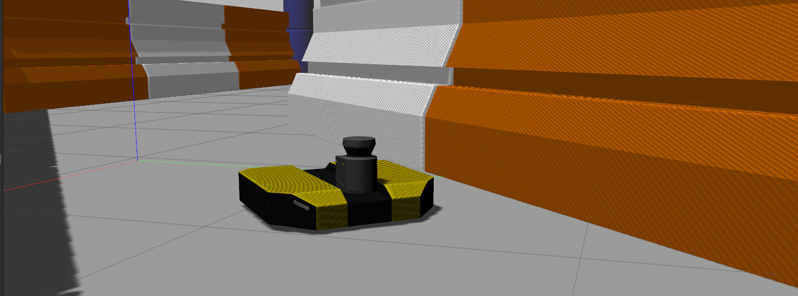
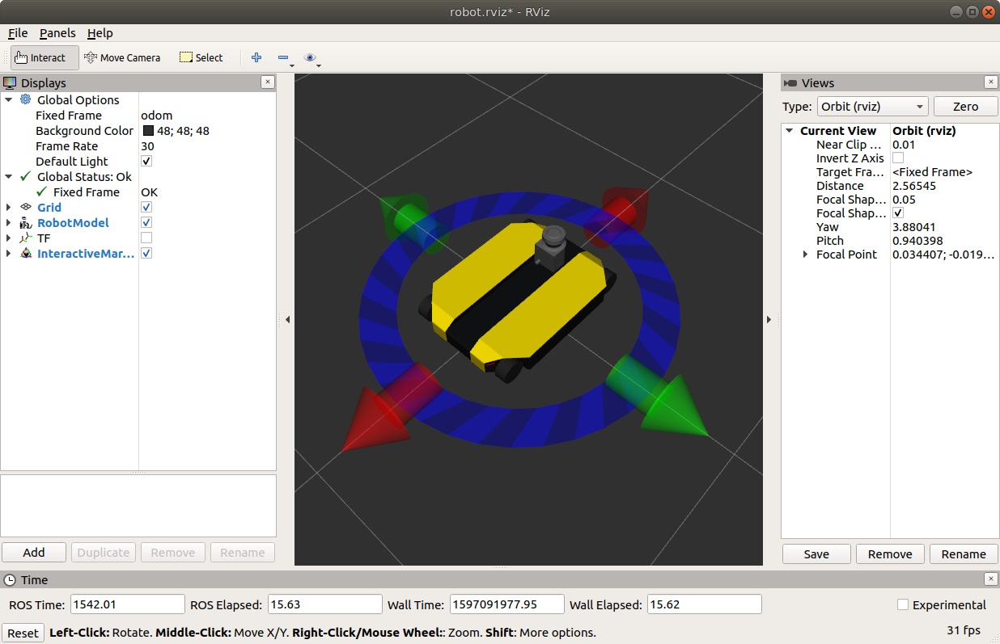

Simulating Dingo
=================

Whether you actually have a Dingo robot or not, the Dingo simulator is a great way to get started with ROS
robot development. In this tutorial, we will go through the basics of starting Gazebo and Rviz and how to drive
your Dingo around.

Installation
------------

To get started with the Dingo simulation, make sure you have a :roswiki:`working ROS installation <ROS/Installation>`
set up on your Ubuntu desktop, and install the Dingo-specific metapackages for desktop and simulation:

.. Note::

  Currently there are no released pre-built APT packages for Dingo; you must install Dingo packages from source.

.. code-block:: bash

  mkdir -p ~/catkin_ws/src
  cd ~/catkin_ws
  catkin_init_workspace src
  cd src
  git clone https://github.com/dingo-cpr/dingo.git
  git clone https://github.com/dingo-cpr/dingo_simulator.git
  git clone https://github.com/dingo-cpr/dingo_desktop.git
  cd ..
  rosdep install --from-paths src --ignore-src
  catkin_make
  source devel/setup.bash

Launch Gazebo
-------------

Gazebo is the most common simulation tool used in ROS. Dingo's model in Gazebo include reasonable
approximations of its dynamics, including wheel slippage, skidding, and inertia. To launch simulated
Dingo in a simple example world, run the following command:

.. code-block:: bash

    roslaunch dingo_gazebo dingo_world.launch

You should see the following window appear, or something like it. You can adjust the camera angle by
clicking and dragging while holding CTRL, ALT, or the shift key:

.. image:: images/dingo_gazebo.png
    :alt: Simulated Dingo in the Race World.

The window which you are looking at is the Gazebo Client. This window shows you the "true" state of the
simulated world which the robot exists in. It communicates on the backend with the Gazebo Server, which
is doing the heavy lifting of actually maintaining the simulated world. At the moment, you're running
both the client and server locally on your own machine, but some advanced users may choose to run heavy
duty simulations on separate hardware and connect to them over the network.

Note that like Dingo itself, Dingo's simulator comes in multiple flavours called configs. A common
one which you will need often is the ``front_laser`` config. If you close the Gazebo window, and then
CTRL-C out of the terminal process, you can re-launch the simulator with a specific config:

.. code-block:: bash

    roslaunch dingo_gazebo dingo_world.launch config:=front_laser

You should now see the simulator running with the simulated SICK LMS111 laser present:

.. image:: images/dingo_gazebo_laser.png
    :alt: Simulated Dingo in the Race World with SICK LMS111.

Gazebo not only simulates the physical presence of the laser scanner, it also provides simulated data
which reflects the robot's surroundings in its simulated world. We will visualize the simulated laser
scanner data shortly.

Launch rviz
-----------

The next tool we will encounter is :roswiki:`rviz`. Although superficially similar in appearance to Gazebo,
rviz has a very different purpose— unlike Gazebo, which shows the reality of the simulated world, rviz shows
the robot's *perception* of its world, whether real or simulated. So while Gazebo won't be used with your
real Jackal, rviz is used with both.

.. Note::

  If you are working with a simulated robot you should leave Gazebo running and open a new terminal to launch rviz.
  Make sure to run ``source devel/setup.bash`` when opening the new terminal.

You can using the following launch invocation to start rviz with a pre-cooked configuration suitable for
visualizing any standard Jackal config:

.. code-block:: bash

    roslaunch dingo_viz view_robot.launch

You should see rviz appear:

.. image:: images/dingo_rviz_laser.png
    :alt: Dingo with laser scanner in rviz.

You can add the lidar data by clicking on the "Add" button in rviz, going to the "By Topic" tab, and choosing the
``/front/scan`` topic.  After this you should see red lines where the lidar detects the barriers, as shown in the image
above.

Driving Dingo-D
----------------

The default Dingo model is Dingo-D, equipped with a differential drive.

Rviz will also show Dingo's interactive markers: the blue ring and red arrows.  These are the simplest way to command your robot
to move around. If you don't see them in your rviz display, select the Interact tool from the top toolbar.
You should see red arrows and a blue circle appear around the Dingo model.

Drag the red arrows in Rviz to move in the linear x and the blue circle to move in the angular z. Rviz shows you
Dingo moving relative to its odometric frame, but it is also moving relative to the simulated world supplied by
Gazebo. If you click over to the Gazebo window, you will see Dingo moving within its simulated world. Or, if you
drive real Dingo using this method, it will have moved in the real world.

Once you start your own development, have your nodes send ``geometry_msgs/Twist`` commands to the ``cmd_vel``
topic to drive Dingo, either real or simulated. This is the standard ROS interface to differential-drive and
holonomic ground vehicles.

Driving Dingo-O
----------------

The omni-directional Dingo-O model can be controlled in exactly the same way was Dingo-D in rviz.  If you have the
``DINGO_OMNI`` enviroment variable set to ``1`` then you will see two pairs of arrows:

The red arrows and blue ring control the robot's forward velocity and turning, as described above.  The green arrows
control the robot's sideways movement.

Game Controllers and Gazebo
-------------------------------

You can also use a game controller to drive your robot in Gazebo.  To set up your computer for teleop using the game controller
follow these steps:

1.  Connect the controller to your PC.

2.  Set the ``DINGO_JOY_DEV`` environment variable to point to your game controller device.  Normally this will be ``/dev/input/js0``.

3.  Launch gazebo as described above.

Controls for driving the robot can be found in :doc:`Driving Dingo <driving>`.  See :doc:`Controller Pairing <controllers>`
for additional information on how to pair your controller with your computer, or refer to the manufacturer's instructions.

Visualizing Sensors
-------------------

The rviz tool is capable of visualizing many common robotic sensors, as well as other data feeds which can give
us clues as to what the robot is doing and why. A great place to start with this is adding the
:roswiki:`LaserScan <rviz/DisplayTypes/LaserScan>` plugin to visualize the laser scans being produced by the
simulated LMS111. In the left panel, click the "Add" button, then select the "Topics" tab, and then select the
``front/scan`` topic:

.. image:: images/rviz-visualize-laser.png
    :alt: Adding a laser scan visualization to Dingo.

Click OK, and you should see laser scan points now visible in the rviz window, relative to the robot:

.. image:: images/dingo_rviz_laser.png
    :alt: Visualizing Dingo with simulated laser scans.

If you use the interactive markers to drive around, you'll notice that the laser scan points move a little bit
but generally stay where they are. This is the first step toward map making using :roswiki:`gmapping`, which
is covered in the next tutorial, :doc:`navigation`.
