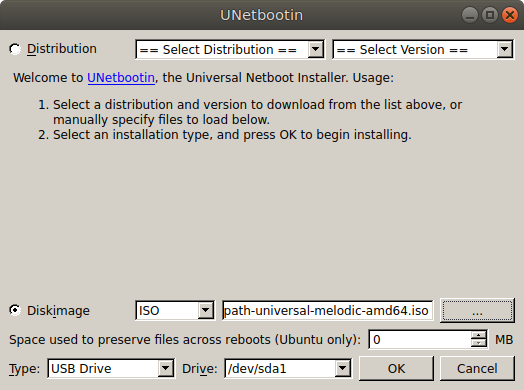

Software Setup
================

This section explains how to install Dingo's operating system and ROS packages.  You will need a USB stick of at least
2GB to create the installation media, a wired internet connection, a monitor, and a keyboard.

Creating OS installation media
-------------------------------

.. note::

  For installing the OS on an Nvidia Jetson device, see :doc:`Jetson Xavier AGX <jetson_xavier>` or
  :doc:`Jetson Nano <jetson_nano>`.

For Intel-family computers (``amd64`` architecture), you can download Clearpath's official OS installation images
from `here <https://packages.clearpathrobotics.com/stable/images/latest/>`_.  For Dingo, use the ``bionic-melodic``
image.

Use unetbootin, or a similar tool, to write the ISO image to a USB memory stick.

.. warning::

  The ISOs currently available from Clearpath are intended to boot into Legacy mode and do not support UEFI.  You may
  need to configure your computer's BIOS to use legacy boot.

Install the OS
---------------

Connect Dingo's PC to the internet using an ethernet cable and connect a monitor and keyboard.  Insert the USB stick
you configured in the previous step and power on the PC.

.. note::

  You may need to configure your PC's BIOS to prioritize booting from the USB device.  On most common motherboards,
  pressing ``delete`` during the initial startup will open the BIOS for configuration.

Installing the OS should require minimal user interaction.  The computer will automatically power off when the
installation has completed.  Once done you can remove the USB stick from the computer.

On first boot after installing the OS you may be prompted to enter a new hostname for the robot.  You may assign any
name you like, though it should be unique for every robot you have.

Configure the OS
-----------------

.. note::

  If you installed the OS using the official Clearpath ISO you may skip this section.  If you are using an Nvidia Jetson,
  Raspberry Pi, or installed Ubuntu 18.04 using a normal Desktop or Server installation image from Canonical you will
  need to do some additional configuration, described below:

First, configure ``apt`` to include the ROS and Clearpath package servers by running the following commands:

.. code-block:: bash

  sudo sh -c 'echo "deb http://packages.ros.org/ros/ubuntu $(lsb_release -sc) main" > /etc/apt/sources.list.d/ros-latest.list'
  sudo apt-key adv --keyserver 'hkp://keyserver.ubuntu.com:80' --recv-key C1CF6E31E6BADE8868B172B4F42ED6FBAB17C654
  wget https://packages.clearpathrobotics.com/public.key -O - | sudo apt-key add -
  sudo sh -c 'echo "deb https://packages.clearpathrobotics.com/stable/ubuntu $(lsb_release -cs) main" > /etc/apt/sources.list.d/clearpath-latest.list'
  sudo apt-get update
  sudo apt-get install python-rosdep ros-melodic-catkin
  sudo rosdep init
  sudo wget https://raw.githubusercontent.com/clearpathrobotics/public-rosdistro/master/rosdep/50-clearpath.list -O /etc/ros/rosdep/sources.list.d/50-clearpath.list
  rosdep update
  echo "source /opt/ros/melodic/setup.bash" >> ~/.bashrc
  source ~/.bashrc

Dingo is configured to use the ``192.168.131.*`` network to address the MCU and any sensors you connect via ethernet.  To
accomplish this, you must run the following commands:

.. code-block:: bash

  sudo apt-get install bridge-utils ifupdown bluez-tools
  sudo nano /etc/network/interfaces

Copy and paste the following into ``/etc/network/interfaces`` and save the file:

.. code-block::

  auto lo br0 br0:0
  iface lo inet loopback

  # Bridge together physical ports on machine, assign standard Clearpath Robot IP.
  iface br0 inet static
    bridge_ports regex (eth.*)|(en.*)
    address 192.168.131.1
    netmask 255.255.255.0
    bridge_maxwait 0

  # Also seek out DHCP IP on those ports, for the sake of easily getting online,
  # maintenance, ethernet radio support, etc.
  iface br0:0 inet dhcp

For managing the robot's wireless network, we recommend installing ``wicd-curses``:

.. code-block:: bash

  sudo apt-get install wicd-curses

Run ``wicd-curses`` and press ``shift + p`` to open the preferences.  Remove the wired interface; the wired interface is
already configured using ``/etc/network/interfaces`` and allowing wicd to control it may cause problems with the network
bridge.

Install the Dingo packages:

.. code-block:: bash

  sudo apt-get install ros-melodic-dingo-robot

You may optionally install the Dingo desktop and simulation packages as well, though these are generally not needed
on the robot:

.. code-block:: bash

  sudo apt-get install ros-melodic-dingo-desktop ros-melodic-dingo-simulator

Install Dingo Software
-----------------------

Once the packages have been installed, the Dingo bringup service must be configured.  Run

.. code-block:: bash

  rosrun dingo_bringup install
  sudo systemctl daemon-reload

Before launching the ``ros`` service, make sure to configure ``/etc/ros/setup.bash`` correctly.  Most importantly,
you should add the following if you have a Dingo-O:

.. code-block:: bash

  export DINGO_OMNI=1

If you have a Dingo-D, instead you may add:

.. code-block:: bash

  export DINGO_OMNI=0

Save ``/etc/ros/setup.bash`` and run

.. code-block:: bash

  sudo systemctl start ros

If you need to restart ROS, you can run

.. code-block:: bash

  sudo systemctl restart ros

at any time.
